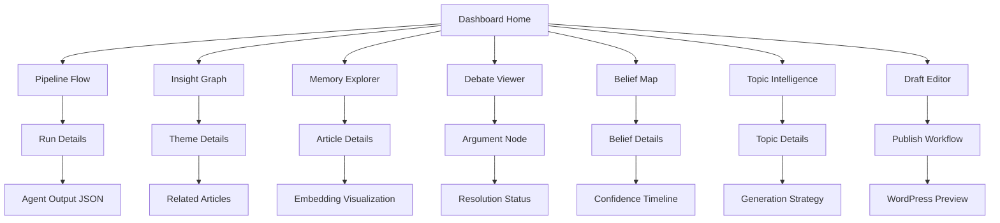
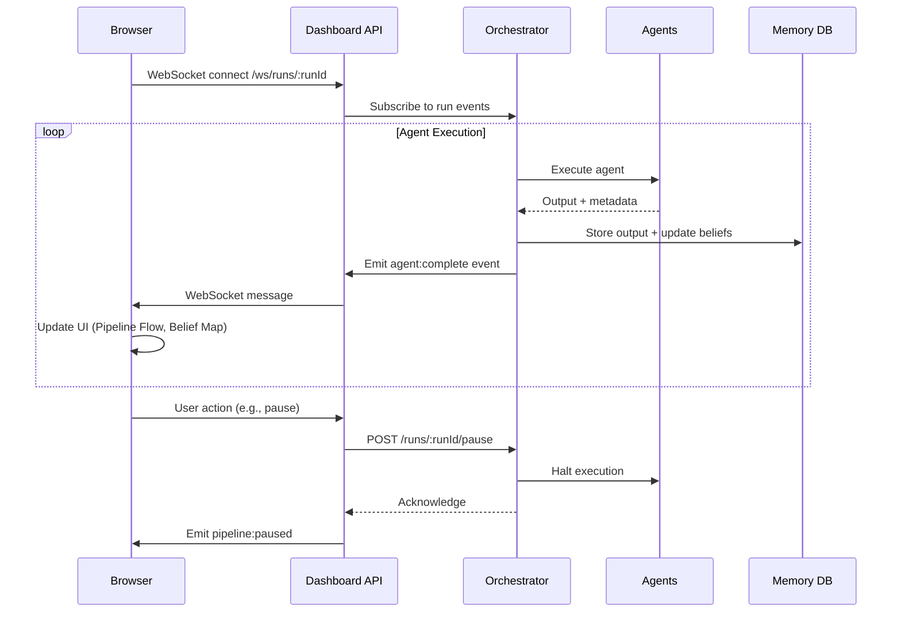

### Cognitive Dashboard Specification

Version: 1.0.0
Status: Ready for Implementation
Last Updated: 2026-04-22


## Overview

The Cognitive Dashboard is the real-time control surface of the BTC Engine. It exposes internal reasoning, memory, and belief formation while enabling structured human intervention.

## Core Objectives

1- *Observability* — Monitor agent execution and system state in real time
2- *Interpretability* — Understand how insights and beliefs are formed
3- *Intervention* — Enable human correction, refinement, and steering
4- *Traceability* — Link every output to its cognitive origin
5- *Auditability* — Maintain a verifiable history of decisions, edits, and system evolution

---

## System Model

The dashboard reflects a cognitive pipeline, not just UI components.

Input → Pipeline → Insights → Debate → Beliefs → Topics → Draft → Publish

Each panel corresponds to a stage or cross-section of this flow.


## Data Model

{
  "node_id": "string",
  "role": "advocate | skeptic",
  "type": "claim | evidence | counterargument | rebuttal",
  "content": "string",
  "children": []
}

Interactions

Expand/collapse arguments

Compare opposing views

Inject human reasoning


## Belief Map

*Purpose*

Track evolving system beliefs.

*Visualization*

Node-link or radial graph

Time-based evolution

*Attributes*

concept

confidence_score

supporting_evidence

last_updated

*Features*

Version history

Confidence evolution

*Interactions*

Timeline scrubbing

Evidence inspection

Manual override


## Topic Intelligence

*Purpose*

Rank candidate topics for exploration.

Scoring Dimensions

Novelty

Depth

Relevance

Coherence


## Data Model

{
  "topic": "string",
  "novelty_score": 0.0,
  "depth_score": 0.0,
  "relevance_score": 0.0,
  "composite_score": 0.0
}

Interactions

Select topic → trigger pipeline

Adjust scoring weights

Compare topics


## Draft Editor (Human-in-the-loop)

*Purpose*
Refine outputs before publishing.

Features

Rich text editing

Source traceability

Version control

Inline suggestions


## Data Model

{
  "draft_id": "string",
  "content": "string",
  "sources": ["insight_id"],
  "version": "number",
  "annotations": []
}

Interactions

Trace text → source insight

Save versions

Publish/export


## Event System

All panels communicate through a shared event bus.

Core Events

PIPELINE_UPDATE

INSIGHT_CREATED

MEMORY_RETRIEVED

DEBATE_UPDATED

BELIEF_UPDATED

TOPIC_RANKED

DRAFT_MODIFIED


## Performance Requirements

Real-time updates: < 200ms latency

Graph scalability: 1,000+ nodes

Vector search: sub-second

Incremental UI updates (no full re-render)


### Core Principles

| Principle | Implementation |
|-----------|---------------|
| **Cognitive Transparency** | Every agent output is inspectable; no black-box reasoning |
| **Controlled Autonomy** | Humans can pause, edit, or override at defined checkpoints |
| **Progressive Disclosure** | Simple overview → deep dive; avoid overwhelming new users |
| **Epistemic Humility** | Confidence scores, uncertainty ranges, and contradiction visibility are always shown |
| **Action-Oriented** | Every insight leads to a clear next action (approve, refine, reject, explore) |

### Target Users

| Role | Primary Tasks | Key Panels |
|------|--------------|------------|
| **Researcher** | Input raw notes, review drafts, approve publication | Pipeline Flow, Draft Editor, Memory Explorer |
| **Editor** | Refine narrative structure, enforce tone, manage publication | Draft Editor, Debate Viewer, Belief Map |
| **Cognitive Architect** | Tune agent prompts, monitor belief evolution, audit contradictions | Belief Map, Insight Graph, Topic Intelligence |
| **System Admin** | Monitor performance, manage secrets, handle failures | Pipeline Flow (ops view), Logs, Metrics |

---

## 🏗️ Information Architecture



### Navigation Structure

```
/ (Home)
├─ /pipeline          # Pipeline Flow
│  ├─ /pipeline/:runId
│  └─ /pipeline/:runId/agent/:agentName
├─ /insights          # Insight Graph
│  ├─ /insights/:themeId
│  └─ /insights/explore
├─ /memory            # Memory Explorer
│  ├─ /memory/search
│  └─ /memory/article/:articleId
├─ /debate            # Debate Viewer
│  ├─ /debate/:runId
│  └─ /debate/:runId/node/:argumentId
├─ /beliefs           # Belief Map
│  ├─ /beliefs/:beliefId
│  └─ /beliefs/timeline
├─ /topics            # Topic Intelligence
│  ├─ /topics/candidates
│  └─ /topics/:topicId
├─ /draft             # Draft Editor
│  ├─ /draft/:articleId
│  └─ /draft/:articleId/publish
└─ /settings          # System Configuration
   ├─ /settings/agents
   ├─ /settings/memory
   └─ /settings/publishing
```

---

## 🎨 Design System

### Color Palette (Cognitive Semantics)

```css
:root {
  /* Core UI */
  --color-bg-primary: #0f172a;      /* Slate 900 - dark mode default */
  --color-bg-secondary: #1e293b;    /* Slate 800 */
  --color-text-primary: #f1f5f9;    /* Slate 100 */
  --color-text-secondary: #94a3b8;  /* Slate 400 */
  --color-border: #334155;          /* Slate 700 */
  
  /* Cognitive States */
  --color-pending: #f59e0b;         /* Amber 500 */
  --color-running: #3b82f6;         /* Blue 500 */
  --color-done: #10b981;            /* Emerald 500 */
  --color-error: #ef4444;           /* Red 500 */
  --color-warning: #f97316;         /* Orange 500 */
  
  /* Belief Confidence */
  --color-belief-speculative: #64748b;  /* Slate 500 - 0.0-0.3 */
  --color-belief-plausible: #8b5cf6;    /* Violet 500 - 0.3-0.6 */
  --color-belief-stable: #10b981;       /* Emerald 500 - 0.6-0.8 */
  --color-belief-consensus: #06b6d4;    /* Cyan 500 - 0.8-1.0 */
  
  /* Debate Roles */
  --color-advocate: #10b981;        /* Emerald - supporting */
  --color-skeptic: #ef4444;         /* Red - challenging */
  --color-synthesis: #8b5cf6;       /* Violet - resolved */
  
  /* Topic Strategies */
  --color-gap: #3b82f6;             /* Blue */
  --color-depth: #f59e0b;           /* Amber */
  --color-contrarian: #ef4444;      /* Red */
  --color-synthesis: #8b5cf6;       /* Violet */
  
  /* Accessibility */
  --color-focus: #fbbf24;           /* Amber 400 - high contrast */
  --color-disabled: #475569;        /* Slate 600 */
}
```

### Typography

```css
:root {
  --font-sans: 'Inter', -apple-system, BlinkMacSystemFont, sans-serif;
  --font-mono: 'JetBrains Mono', 'Fira Code', monospace;
  
  --text-xs: 0.75rem;    /* 12px */
  --text-sm: 0.875rem;   /* 14px */
  --text-base: 1rem;     /* 16px */
  --text-lg: 1.125rem;   /* 18px */
  --text-xl: 1.25rem;    /* 20px */
  --text-2xl: 1.5rem;    /* 24px */
  
  --font-light: 300;
  --font-regular: 400;
  --font-medium: 500;
  --font-semibold: 600;
  --font-bold: 700;
}
```

### Component Library (React + Tailwind)

```bash
src/components/ui/
├─ Button/          # Primary, secondary, icon, loading states
├─ Card/            # Cognitive panel container with header actions
├─ Badge/           # Status, confidence, strategy tags
├─ Progress/        # Pipeline stage, confidence meter
├─ Tooltip/         # Epistemic explanations (hover for "why?")
├─ Modal/           # Intervention dialogs (edit, approve, reject)
├─ Table/           # Sortable, filterable data grids
├─ Graph/           # D3.js wrapper for force-directed + timeline viz
├─ Editor/          # Rich text + structured JSON hybrid editor
└─ Search/          # Semantic + keyword hybrid search input
```

---

## 📋 Panel Specifications

### 1️⃣ Pipeline Flow

**Purpose**: Real-time monitoring of agent execution for a single research-to-publication run.

#### Layout

```
┌─────────────────────────────────────┐
│ Pipeline: [Run ID] ▼  [Refresh] 🔁  │
├─────────────────────────────────────┤
│ [Status Badge] [Started] [Duration] │
├─────────────────────────────────────┤
│                                     │
│  ●──●──●──●──●──●──●               │
│  │  │  │  │  │  │  │               │
│IngestAnalystMemoryArchCritPubRefl  │
│[✓] [▶] [○] [○] [○] [○] [○]         │
│                                     │
├─────────────────────────────────────┤
│ Agent Details (expandable)          │
│ ┌─────────────────────────┐        │
│ │ Analyst Output          │        │
│ │ {                       │        │
│ │   "claims": [...],     │        │
│ │   "tensions": [...]    │        │
│ │ }                       │        │
│ │ [Copy JSON] [Visualize]│        │
│ └─────────────────────────┘        │
├─────────────────────────────────────┤
│ Actions                             │
│ [Pause] [Retry Agent] [View Logs]  │
└─────────────────────────────────────┘
```

#### Interactive Elements

| Element | Behavior | Data Source |
|---------|----------|-------------|
| **Stage Node** | Click → expand agent details; color = status | `GET /api/runs/:runId` |
| **Agent Output** | Toggle JSON/visual view; copy to clipboard | `GET /api/runs/:runId/agents/:agentName` |
| **Pause Button** | Halt pipeline at current stage; queue remains | `POST /api/runs/:runId/pause` |
| **Retry Agent** | Re-run failed agent with same input | `POST /api/runs/:runId/agents/:agentName/retry` |
| **View Logs** | Modal with Winston logs filtered by run ID | `GET /api/logs?runId=:runId` |

#### Real-Time Updates

```javascript
// WebSocket subscription
const ws = new WebSocket(`wss://${API_HOST}/ws/runs/${runId}`);

ws.onmessage = (event) => {
  const { type, payload } = JSON.parse(event.data);
  
  switch (type) {
    case 'agent:start':
      updateStageStatus(payload.agent, 'running');
      break;
    case 'agent:complete':
      updateStageStatus(payload.agent, 'done');
      updateAgentOutput(payload.agent, payload.output);
      break;
    case 'agent:error':
      updateStageStatus(payload.agent, 'error');
      showErrorToast(payload.error);
      break;
    case 'pipeline:complete':
      showSuccessToast('Pipeline complete');
      navigateTo(`/draft/${payload.articleId}`);
      break;
  }
};
```

#### Accessibility

- Stage nodes: `role="listitem"`, `aria-current="step"` for active stage
- Status badges: `aria-label="Status: running"` + color + icon
- Keyboard nav: Arrow keys between stages, Enter to expand

---

### 2️⃣ Insight Graph

**Purpose**: Visualize thematic relationships across the entire knowledge base; identify clusters, gaps, and evolution.

#### Layout

```
┌─────────────────────────────────────┐
│ Insight Graph  [Search Themes] 🔍   │
├─────────────────────────────────────┤
│ Filters:                            │
│ [✓] Show beliefs  [✓] Show articles │
│ [ ] Hide low-confidence (<0.6)      │
│ Time Range: [2025] ▼ - [2026] ▼    │
├─────────────────────────────────────┤
│                                     │
│         ● "attention"              │
│        / \                          │
│   ● "cognitive"  ● "multitasking"  │
│      |           /    \            │
│   ● "load"   ● "illusion" ● "myth"│
│                                     │
│  [Zoom] [Pan] [Reset View]         │
│                                     │
├─────────────────────────────────────┤
│ Node Details (on hover/click)       │
│ ┌─────────────────────────┐        │
│ │ Theme: "cognitive load"│        │
│ │ Articles: 7            │        │
│ │ Avg. Novelty: 7.2/10   │        │
│ │ Beliefs: 3             │        │
│ │ [View Articles]        │        │
│ └─────────────────────────┘        │
└─────────────────────────────────────┘
```

#### Visualization Spec (D3.js Force-Directed)

```javascript
// src/components/Graph/InsightGraph.jsx
import { forceSimulation, forceManyBody, forceLink } from 'd3-force';

const config = {
  width: 800,
  height: 600,
  node: {
    radius: d => 4 + (d.article_count * 0.8), // Size by frequency
    color: d => getConfidenceColor(d.avg_confidence),
    stroke: d => d.is_belief ? '#fff' : 'none'
  },
  link: {
    width: d => Math.sqrt(d.strength),
    color: '#475569',
    opacity: 0.6
  },
  simulation: {
    alphaDecay: 0.02,
    velocityDecay: 0.4,
    forces: [
      forceManyBody().strength(-30), // Repulsion
      forceLink().id(d => d.id).distance(100).strength(0.1)
    ]
  }
};

// Node data structure
{
  id: "theme_cognitive_load",
  label: "cognitive load",
  type: "theme", // or "belief"
  article_count: 7,
  avg_confidence: 0.82,
  avg_novelty: 7.2,
  beliefs: ["belief_attention_finite"],
  first_seen: "2025-11-03",
  last_updated: "2026-04-20"
}

// Link data structure
{
  source: "theme_cognitive_load",
  target: "theme_multitasking",
  strength: 0.7, // Co-occurrence frequency normalized
  relationship: "causal" // or "conceptual", "contradictory"
}
```

#### Interactions

| Action | Result |
|--------|--------|
| **Hover Node** | Show tooltip with stats; highlight connected nodes |
| **Click Node** | Open side panel with article list + belief details |
| **Drag Node** | Reposition temporarily (resets on zoom) |
| **Double-Click** | Navigate to `/insights/:themeId` detail view |
| **Shift+Click Multiple** | Compare themes in modal (novelty/depth over time) |
| **Right-Click** | Context menu: "Explore Gap", "Generate Topic", "Export Subgraph" |

#### API Contract

```typescript
// GET /api/insights/graph?timeRange=2025-2026&minConfidence=0.6
{
  "nodes": InsightNode[],
  "links": InsightLink[],
  "metadata": {
    "total_themes": 42,
    "total_beliefs": 18,
    "time_range": ["2025-01-01", "2026-04-22"],
    "filters_applied": { "min_confidence": 0.6 }
  }
}

// GET /api/insights/themes/:themeId
{
  "theme": {
    "id": "theme_cognitive_load",
    "label": "cognitive load",
    "description": "The mental effort required to process information",
    "first_seen": "2025-11-03",
    "article_count": 7,
    "avg_novelty": 7.2,
    "avg_depth": 8.1,
    "related_beliefs": ["belief_attention_finite"],
    "evolution": [
      { "date": "2025-11", "novelty": 8.5, "depth": 6.2 },
      { "date": "2026-01", "novelty": 7.1, "depth": 7.8 },
      { "date": "2026-04", "novelty": 6.8, "depth": 8.5 }
    ]
  },
  "articles": ArticleSummary[],
  "gaps": [
    {
      "dimension": "emotional impact",
      "rationale": "Discussed in 0/7 articles despite Analyst tensions",
      "suggested_topic": "The Emotional Cost of Cognitive Load"
    }
  ]
}
```

---

### 3️⃣ Memory Explorer

**Purpose**: Search, browse, and manage the system's semantic memory; understand what the system "remembers" and why.

#### Layout

```
┌─────────────────────────────────────┐
│ Memory Explorer  [🔍 Semantic + Keyword] │
├─────────────────────────────────────┤
│ Search Mode: [● Semantic] [○ Keyword]   │
│ Filters:                              │
│ [✓] Articles  [✓] Themes  [✓] Beliefs │
│ Novelty: [6 ─────●──── 10]           │
│ Date: [2025-01-01] to [2026-04-22]   │
├─────────────────────────────────────┤
│ Results (list or grid)                │
│ ┌─────────────────────────┐          │
│ │ 📄 Multitasking Is...  │          │
│ │ Novelty: 7.2 | Depth: 8.1│          │
│ │ Themes: cognitive...   │          │
│ │ [Preview] [Compare]    │          │
│ └─────────────────────────┘          │
│ ┌─────────────────────────┐          │
│ │ 💡 belief_attention... │          │
│ │ Confidence: 0.91 ●●●●○│          │
│ │ Supported by: 12 arts│          │
│ │ [View Evidence]       │          │
│ └─────────────────────────┘          │
├─────────────────────────────────────┤
│ Selected Item Details (slide-over)   │
│ ┌─────────────────────────┐          │
│ │ Article: "Multitasking..."│        │
│ │ Abstract: <preview>    │          │
│ │ Embedding Viz:         │          │
│ │ [●●●●○●●●●○]          │          │
│ │ Similar: [list]        │          │
│ │ Actions:               │          │
│ │ [Edit Memory] [Delete]│          │
│ └─────────────────────────┘          │
└─────────────────────────────────────┘
```

#### Search Implementation

```javascript
// Hybrid search: semantic + keyword fallback
async function searchMemory(query, options = {}) {
  const { mode = 'semantic', filters = {} } = options;
  
  if (mode === 'semantic') {
    // Vector similarity search
    const embedding = await embed(query);
    const results = await pinecone.query({
      vector: embedding,
      topK: 20,
      filter: buildPineconeFilter(filters),
      includeMeta true
    });
    return results.matches.map(m => ({
      ...m.metadata,
      score: m.score,
      type: inferType(m.metadata)
    }));
  } else {
    // Keyword search with boosting
    return await keywordSearch(query, {
      boost: { title: 3, themes: 2, abstract: 1 },
      filters,
      limit: 20
    });
  }
}

function buildPineconeFilter(filters) {
  const f = {};
  if (filters.novelty) f.novelty_score = { $gte: filters.novelty[0] };
  if (filters.date) f.published_at = { $gte: filters.date[0], $lte: filters.date[1] };
  if (filters.types?.length) f.type = { $in: filters.types };
  return Object.keys(f).length ? f : undefined;
}
```

#### Embedding Visualization

```javascript
// Project 3072-dim embedding to 2D for preview (t-SNE or UMAP pre-computed)
const EmbeddingViz = ({ embeddingId, width = 200, height = 100 }) => {
  const [projection, setProjection] = useState(null);
  
  useEffect(() => {
    // Fetch pre-computed 2D projection from backend
    fetch(`/api/memory/embeddings/${embeddingId}/projection`)
      .then(r => r.json())
      .then(setProjection);
  }, [embeddingId]);
  
  if (!projection) return <Skeleton />;
  
  return (
    <svg width={width} height={height} className="bg-slate-800 rounded">
      {/* Scatter plot of nearest neighbors */}
      {projection.neighbors.map((n, i) => (
        <circle
          key={n.id}
          cx={n.x}
          cy={n.y}
          r={3}
          fill={n.type === 'article' ? '#3b82f6' : '#8b5cf6'}
          opacity={n.similarity}
          className="transition-opacity hover:opacity-100"
        />
      ))}
      {/* Query point */}
      <circle cx={projection.query.x} cy={projection.query.y} r={5} fill="#fbbf24" stroke="#fff" />
    </svg>
  );
};
```

#### Memory Management Actions

| Action | Permission | Effect |
|--------|-----------|--------|
| **Edit Memory** | Editor+ | Update metadata (themes, novelty score); triggers re-embedding |
| **Delete** | Admin only | Soft-delete (mark `archived: true`); removable from vector index |
| **Export** | All | Download as JSON or CSV for audit/backup |
| **Compare** | All | Side-by-side view of 2-4 items (novelty/depth/beliefs over time) |

---

### 4️⃣ Debate Viewer

**Purpose**: Inspect pre-publication intellectual conflict; understand how Advocate/Skeptic tension was resolved.

#### Layout

```
┌─────────────────────────────────────┐
│ Debate: [Run ID]  [Round: 2/3] ◀ ▶ │
├─────────────────────────────────────┤
│ Original Argument (Architect Output)│
│ ┌─────────────────────────┐        │
│ │ Title: "Multitasking..."│        │
│ │ Abstract: <text>       │        │
│ │ Sections: [list]       │        │
│ └─────────────────────────┘        │
├─────────────────────────────────────┤
│ Advocate vs. Skeptic (split view)   │
│ ┌─────────────────┬───────────────┐│
│ │ 🟢 Advocate    │ 🔴 Skeptic   ││
│ │                 │               ││
│ │ • Reinforces   │ • Questions  ││
│ │   claim X      │   assumption Y││
│ │ • Adds evidence│ • Presents   ││
│ │   type Z       │   counter A  ││
│ │                 │               ││
│ │ [Expand JSON]  │ [Expand JSON]││
│ └─────────────────┴───────────────┘│
├─────────────────────────────────────┤
│ Synthesis (Resolution)              │
│ ┌─────────────────────────┐        │
│ │ Refined Position:      │        │
│ │ "While multitasking    │        │
│ │ reduces deep work,     │        │
│ │ certain low-cognitive │        │
│ │ tasks can coexist..." │        │
│ │                        │        │
│ │ Confidence Delta: +0.07│        │
│ │ [●●●●●●●●○○] 0.78    │        │
│ │                        │        │
│ │ Conditions:            │        │
│ │ • Advocate holds when:│        │
│ │   - tasks are automated│        │
│ │ • Skeptic holds when: │        │
│ │   - tasks require    │        │
│ │     working memory   │        │
│ └─────────────────────────┘        │
├─────────────────────────────────────┤
│ Actions                             │
│ [Accept Synthesis] [Request R3]    │
│ [View Full JSON] [Export Debate]   │
└─────────────────────────────────────┘
```

#### Argument Tree Visualization

```javascript
// Recursive component for nested arguments
const ArgumentNode = ({ node, depth = 0 }) => (
  <div className={`ml-${depth * 4} border-l-2 border-slate-700 pl-4`}>
    <div className={`p-3 rounded ${node.role === 'advocate' ? 'bg-emerald-900/30' : 'bg-red-900/30'}`}>
      <div className="flex items-center gap-2">
        <Badge color={node.role === 'advocate' ? 'success' : 'error'}>
          {node.role}
        </Badge>
        <span className="text-sm text-slate-400">{node.confidence?.toFixed(2)}</span>
      </div>
      <p className="mt-2 text-slate-200">{node.statement}</p>
      
      {node.evidence?.length > 0 && (
        <details className="mt-2">
          <summary className="text-xs text-slate-400 cursor-pointer">
            {node.evidence.length} supporting points
          </summary>
          <ul className="mt-1 text-sm text-slate-300 list-disc list-inside">
            {node.evidence.map((e, i) => <li key={i}>{e}</li>)}
          </ul>
        </details>
      )}
    </div>
    
    {node.children?.length > 0 && (
      <div className="mt-2 space-y-2">
        {node.children.map(child => (
          <ArgumentNode key={child.id} node={child} depth={depth + 1} />
        ))}
      </div>
    )}
  </div>
);
```

#### Resolution Workflow

```javascript
// POST /api/debates/:debateId/resolve
{
  "action": "accept" | "revise" | "reject",
  "human_notes": "Optional editorial feedback",
  "override_confidence": 0.85 // Optional: manual confidence adjustment
}

// Response
{
  "status": "resolved",
  "next_step": "publish" | "re-debate" | "draft-edit",
  "updated_beliefs": [
    {
      "belief_id": "belief_multitasking_contextual",
      "old_confidence": 0.71,
      "new_confidence": 0.78,
      "delta_reason": "Synthesis resolved tension between efficiency and depth"
    }
  ]
}
```

---

### 5️⃣ Belief Map

**Purpose**: Visualize the system's evolving world model; track confidence, evidence, and contradictions over time.

#### Layout

```
┌─────────────────────────────────────┐
│ Belief Map  [🔍 Search Beliefs]     │
├─────────────────────────────────────┤
│ View: [● Graph] [○ List] [○ Timeline]│
│ Filters:                            │
│ [✓] Stable (≥0.8) [✓] Plausible    │
│ [ ] Speculative (<0.4)             │
│ Domain: [All] ▼  [Cognition] [AI]  │
├─────────────────────────────────────┤
│ Graph View (force-directed)         │
│                                     │
│   ● "attention is finite"          │
│   [0.91 ●●●●●●●●●○]               │
│          |                          │
│   ● "multitasking reduces..."     │
│   [0.84 ●●●●●●●●○○]               │
│          |                          │
│   ● "deep work requires..."       │
│   [0.76 ●●●●●●●○○○]               │
│                                     │
│  Node Size = Evidence Count        │
│  Color = Confidence (see legend)   │
│  Border = Contradictions Present   │
├─────────────────────────────────────┤
│ Belief Details (on click)           │
│ ┌─────────────────────────┐        │
│ │ Belief: "attention is  │        │
│ │ finite cognitive       │        │
│ │ resource"              │        │
│ │                        │        │
│ │ Confidence: 0.91       │        │
│ │ [●●●●●●●●●○]          │        │
│ │                        │        │
│ │ Evidence:              │        │
│ │ ✓ 12 supporting arts  │        │
│ │ ⚠ 2 challenging arts │        │
│ │                        │        │
│ │ Timeline:              │        │
│ │ [sparkline chart]     │        │
│ │                        │        │
│ │ Related Beliefs:      │        │
│ │ • cognitive load      │        │
│ │ • working memory      │        │
│ │                        │        │
│ │ Actions:               │        │
│ │ [View Evidence]       │        │
│ │ [Adjust Confidence]   │        │
│ │ [Flag Contradiction]  │        │
│ └─────────────────────────┘        │
├─────────────────────────────────────┤
│ Timeline View (alternative tab)     │
│ ┌─────────────────────────┐        │
│ │ Confidence Over Time   │        │
│ │                         │        │
│ │ 1.0 ┤                  ╭─●        │
│ │ 0.8 ┤         ╭───────╯          │
│ │ 0.6 ┤    ╭────╯                  │
│ │ 0.4 ┤ ╭──╯                       │
│ │ 0.2 ┤─╯                          │
│ │     └─────────────────          │
│ │      Nov  Jan  Mar  Apr         │
│ │                                 │
│ │ Events:                         │
│ │ • Article published (▲)         │
│ │ • Contradiction found (▼)      │
│ │ • Human edit (✎)               │
│ └─────────────────────────┘        │
└─────────────────────────────────────┘
```

#### Belief Data Structure

```typescript
interface Belief {
  id: string; // "belief_attention_finite"
  statement: string;
  confidence: number; // 0.0-1.0
  status: 'speculative' | 'plausible' | 'stable' | 'consensus';
  created_at: string;
  last_updated: string;
  
  evidence: {
    supporting: { article_id: string; strength: number }[];
    contradicting: { article_id: string; strength: number }[];
  };
  
  relationships: {
    supports: string[]; // belief IDs this belief supports
    contradicts: string[]; // belief IDs this belief challenges
    related: string[]; // conceptual neighbors
  };
  
  evolution: {
    date: string;
    confidence: number;
    event: 'article_published' | 'contradiction_found' | 'human_edit' | 'synthesis';
    delta: number; // change from previous
  }[];
}
```

#### Confidence Adjustment (Human-in-the-Loop)

```javascript
// Modal: Adjust Belief Confidence
const ConfidenceAdjustModal = ({ belief, onClose }) => {
  const [newConfidence, setNewConfidence] = useState(belief.confidence);
  const [reason, setReason] = useState('');
  
  const handleSubmit = async () => {
    await fetch(`/api/beliefs/${belief.id}/confidence`, {
      method: 'POST',
      body: JSON.stringify({
        new_confidence: newConfidence,
        reason,
        edited_by: currentUser.id
      })
    });
    
    // Log audit event
    trackEvent('belief_confidence_edited', {
      belief_id: belief.id,
      old: belief.confidence,
      new: newConfidence,
      reason
    });
    
    onClose();
  };
  
  return (
    <Modal title="Adjust Belief Confidence">
      <p className="text-slate-300 mb-4">
        Current: {belief.confidence.toFixed(2)} 
        <ConfidenceMeter value={belief.confidence} />
      </p>
      
      <Slider
        min={0} max={1} step={0.01}
        value={newConfidence}
        onChange={setNewConfidence}
        marks={{ 0.3: 'Speculative', 0.6: 'Plausible', 0.8: 'Stable' }}
      />
      
      <TextArea
        label="Reason for adjustment (required for audit)"
        value={reason}
        onChange={setReason}
        placeholder="e.g., New evidence from recent article #42 suggests..."
      />
      
      <div className="flex justify-end gap-2 mt-4">
        <Button variant="secondary" onClick={onClose}>Cancel</Button>
        <Button 
          variant="primary" 
          onClick={handleSubmit}
          disabled={!reason || Math.abs(newConfidence - belief.confidence) < 0.01}
        >
          Update Confidence
        </Button>
      </div>
    </Modal>
  );
};
```

---

### 6️⃣ Topic Intelligence

**Purpose**: Review, rank, and select autonomous topic candidates; understand generation strategy and expected insight.

#### Layout

```
┌─────────────────────────────────────┐
│ Topic Intelligence  [Regenerate] 🔄│
├─────────────────────────────────────┤
│ Generation Strategy:                │
│ [● All] [○ Gap] [○ Depth]          │
│ [○ Contrarian] [○ Synthesis]       │
│ Min. Composite Score: [6.5 ──●── 10]│
├─────────────────────────────────────┤
│ Ranked Candidates                   │
│ ┌─────────────────────────┐        │
│ │ #1  [Gap]              │        │
│ │ "The Emotional Cost of│        │
│ │ Multitasking Nobody   │        │
│ │ Measures"             │        │
│ │                        │        │
│ │ Scores:               │        │
│ │ Novelty: 8.2 ●●●●●●●●○○│        │
│ │ Depth:   7.8 ●●●●●●●○○○│        │
│ │ Relevance: 9.1 ●●●●●●●●●○│      │
│ │ Composite: 8.3 ★      │        │
│ │                        │        │
│ │ Rationale:            │        │
│ │ "Past work focused on│        │
│ │ cognition, not emotion"│        │
│ │                        │        │
│ │ Expected Insight:     │        │
│ │ "Multitasking fragments│        │
│ │ emotional continuity" │        │
│ │                        │        │
│ │ [Preview Article]     │        │
│ │ [Approve] [Reject]    │        │
│ └─────────────────────────┘        │
│                                    │
│ ┌─────────────────────────┐        │
│ │ #2  [Contrarian]       │        │
│ │ "When Multitasking    │        │
│ │ Actually Works"       │        │
│ │ Scores: ...           │        │
│ └─────────────────────────┘        │
├─────────────────────────────────────┤
│ Generation Context                  │
│ ┌─────────────────────────┐        │
│ │ Explored Themes:       │        │
│ │ • cognitive load (7x)  │        │
│ │ • productivity myth (5x)│        │
│ │                        │        │
│ │ Detected Gaps:         │        │
│ │ • emotional impact     │        │
│ │ • organizational behavior│      │
│ │ • developmental psych  │        │
│ │                        │        │
│ │ Reflection Insights:   │        │
│ │ Last 3 articles avg.   │        │
│ │ novelty: 6.8 (↓0.4)    │        │
│ │ → Prioritize novelty   │        │
│ └─────────────────────────┘        │
└─────────────────────────────────────┘
```

#### Topic Scoring Visualization

```javascript
// Radar chart for multi-dimensional scoring
const TopicScores = ({ topic }) => {
  const data = [
    { axis: 'Novelty', value: topic.novelty_estimate * 10, max: 10 },
    { axis: 'Depth', value: topic.depth_potential * 10, max: 10 },
    { axis: 'Relevance', value: topic.relevance_score * 10, max: 10 },
    { axis: 'Feasibility', value: topic.feasibility * 10, max: 10 }
  ];
  
  return (
    <RadarChart 
      data={data}
      size={150}
      colors={{ Novelty: '#3b82f6', Depth: '#f59e0b', Relevance: '#10b981', Feasibility: '#8b5cf6' }}
    />
  );
};
```

#### Approval Workflow

```javascript
// POST /api/topics/:topicId/approve
{
  "action": "approve" | "reject" | "revise",
  "feedback": "Optional: why rejected or how to revise",
  "schedule": "immediate" | "next-available" | "custom-date"
}

// Response
{
  "status": "queued",
  "pipeline_run_id": "run_abc123",
  "estimated_completion": "2026-04-22T15:30:00Z",
  "next_steps": [
    "Monitor progress at /pipeline/run_abc123",
    "Edit draft before publish at /draft/:articleId"
  ]
}
```

#### Regeneration Controls

```javascript
// Advanced: Force specific generation strategy
const RegenerateControls = ({ onRegenerate }) => {
  const [strategies, setStrategies] = useState(['gap', 'depth', 'contrarian', 'synthesis']);
  const [forceThemes, setForceThemes] = useState([]);
  
  return (
    <div className="space-y-4">
      <div>
        <label className="text-sm text-slate-400">Generation Strategies</label>
        <div className="flex flex-wrap gap-2 mt-2">
          {['gap', 'depth', 'contrarian', 'synthesis'].map(s => (
            <ToggleChip
              key={s}
              label={s}
              active={strategies.includes(s)}
              onChange={() => toggleStrategy(s)}
              color={`var(--color-${s})`}
            />
          ))}
        </div>
      </div>
      
      <div>
        <label className="text-sm text-slate-400">Force Theme Inclusion</label>
        <SemanticSearch
          placeholder="Search themes to include..."
          onSelect={theme => setForceThemes([...forceThemes, theme])}
          source="themes"
        />
        {forceThemes.length > 0 && (
          <div className="flex flex-wrap gap-1 mt-2">
            {forceThemes.map(t => (
              <Badge key={t.id} onRemove={() => removeTheme(t.id)}>
                {t.label}
              </Badge>
            ))}
          </div>
        )}
      </div>
      
      <Button 
        variant="primary" 
        onClick={() => onRegenerate({ strategies, forceThemes })}
        loading={isRegenerating}
      >
        Regenerate Topics
      </Button>
    </div>
  );
};
```

---

### 7️⃣ Draft Editor

**Purpose**: Human-in-the-loop refinement of AI-generated drafts before publication; preserve cognitive structure while improving narrative.

#### Layout

```
┌─────────────────────────────────────┐
│ Draft Editor: "Multitasking Is..."  │
│ [← Back] [Preview] [Publish ▼]     │
├─────────────────────────────────────┤
│ Left Panel: Cognitive Structure     │
│ ┌─────────────────────────┐        │
│ │ Article Blueprint       │        │
│ │                         │        │
│ │ Title:                  │        │
│ │ [Multitasking Is a     │        │
│ │  Beautiful Lie] ✎      │        │
│ │                         │        │
│ │ Abstract:              │        │
│ │ [2-3 sentences...] ✎  │        │
│ │                         │        │
│ │ Sections (drag to reorder):│    │
│ │ 1. The Efficiency Trap │        │
│ │    [✎] [▲] [▼] [×]    │        │
│ │ 2. Cognitive Fragmentation│     │
│ │    [✎] [▲] [▼] [×]    │        │
│ │ 3. Toward Intentional │        │
│ │    Attention          │        │
│ │    [✎] [▲] [▼] [×]    │        │
│ │                         │        │
│ │ [+ Add Section]        │        │
│ │                         │        │
│ │ Beliefs Engaged:      │        │
│ │ • belief_attention_...│        │
│ │ • belief_cognitive_...│        │
│ │ [View Evidence]       │        │
│ └─────────────────────────┘        │
├─────────────────────────────────────┤
│ Right Panel: Rich Text Editor       │
│ ┌─────────────────────────┐        │
│ │ [B] [I] [H2] [H3] [Link]│        │
│ │                         │        │
│ │ <h2>The Efficiency Trap</h2>   │
│ │ <p>We live in an era that...</p>│
│ │                         │        │
│ │ [AI Assist: Rewrite this │       │
│ │  paragraph for clarity] │       │
│ │                         │        │
│ │ <h2>Cognitive...</h2>  │        │
│ │ ...                     │        │
│ └─────────────────────────┘        │
├─────────────────────────────────────┤
│ Bottom Panel: Publishing Controls   │
│ ┌─────────────────────────┐        │
│ │ WordPress Preview       │        │
│ │ [Toggle Desktop/Mobile] │        │
│ │                         │        │
│ │ Metadata:              │        │
│ │ Category: [Insights ▼] │        │
│ │ Tags: [cognition, ...] │        │
│ │ Excerpt: [auto/generated] ✎    │
│ │                         │        │
│ │ Publish Options:       │        │
│ │ [● Publish Now]        │        │
│ │ [○ Schedule] [date]   │        │
│ │ [○ Save as Draft]      │        │
│ │                         │        │
│ │ Final Checks:          │        │
│ │ [✓] Belief confidence ≥0.75│   │
│ │ [✓] Novelty score ≥6.0 │        │
│ │ [⚠] 1 contradiction unresolved││
│ │                         │        │
│ │ [Publish Article]      │        │
│ └─────────────────────────┘        │
└─────────────────────────────────────┘
```

#### Editor Features

| Feature | Implementation | Purpose |
|---------|---------------|---------|
| **Structured Editing** | Title/abstract/sections bound to JSON schema; changes sync to cognitive model | Preserve argument structure while allowing narrative refinement |
| **Belief Awareness** | Inline badges show which beliefs a paragraph engages; hover for confidence/evidence | Ensure publication aligns with system's epistemic state |
| **AI Assist** | Contextual rewrite suggestions (tone, clarity, depth) via lightweight LLM call | Enhance human editing, not replace it |
| **Contradiction Alerts** | Warning banner if draft engages unresolved tensions; link to Debate Viewer | Prevent publishing logically unstable content |
| **Version History** | Git-like diff view of edits; revert to any prior version | Audit trail for cognitive decisions |

#### Publishing Validation

```javascript
// Pre-publish checks (run on "Publish" click)
async function validateForPublish(article, beliefs) {
  const errors = [];
  const warnings = [];
  
  // 1. Belief confidence check
  for (const beliefId of article.belief_refs) {
    const belief = beliefs.find(b => b.id === beliefId);
    if (!belief) {
      errors.push(`Referenced belief "${beliefId}" not found`);
    } else if (belief.confidence < 0.75) {
      warnings.push(`Belief "${belief.statement}" has low confidence (${belief.confidence.toFixed(2)})`);
    }
  }
  
  // 2. Novelty/depth thresholds
  if (article.novelty_score < 6.0) {
    warnings.push('Novelty score below threshold (6.0)');
  }
  
  // 3. Unresolved contradictions
  const unresolved = await getUnresolvedContradictions(article.id);
  if (unresolved.length > 0) {
    warnings.push(`${unresolved.length} contradiction(s) unresolved in debate`);
  }
  
  // 4. WordPress schema validation
  const wpValid = await validateWordPressSchema(article);
  if (!wpValid) {
    errors.push('Article fails WordPress schema validation');
  }
  
  return { errors, warnings, canPublish: errors.length === 0 };
}
```

#### WordPress Integration

```javascript
// POST /api/publish/wordpress
{
  "article_id": "art_abc123",
  "options": {
    "status": "publish", // or "draft", "pending"
    "category": "Insights",
    "tags": ["cognition", "productivity"],
    "featured_image": "auto-generated",
    "seo": {
      "meta_title": "auto",
      "meta_description": "auto",
      "focus_keyword": "multitasking cognitive load"
    }
  }
}

// Response
{
  "success": true,
  "wordpress_url": "https://your-site.com/multitasking-beautiful-lie",
  "post_id": 4281,
  "published_at": "2026-04-22T14:30:00Z",
  "next_actions": [
    { "label": "View Post", "url": "https://your-site.com/..." },
    { "label": "Share on Social", "action": "share" },
    { "label": "Trigger Reflection", "action": "reflect" }
  ]
}
```

---

## ⚙️ Technical Implementation

### Frontend Stack

```json
{
  "framework": "Next.js 14 (App Router)",
  "language": "TypeScript 5.4",
  "styling": "Tailwind CSS 3.4 + CSS variables",
  "state": "Zustand (lightweight) + React Query (server state)",
  "realtime": "WebSocket + Server-Sent Events fallback",
  "visualization": "D3.js 7.9 + React Wrap",
  "editor": "TipTap (ProseMirror-based) + custom cognitive plugins",
  "testing": "Vitest + React Testing Library + Playwright (E2E)",
  "a11y": "axe-core + manual keyboard testing"
}
```

### State Management

```typescript
// src/store/cognitive-store.ts
import { create } from 'zustand';
import { subscribeWithSelector } from 'zustand/middleware';

interface CognitiveState {
  // Global
  currentRunId: string | null;
  userRole: 'researcher' | 'editor' | 'architect' | 'admin';
  
  // Pipeline
  pipeline: PipelineRun | null;
  agentOutputs: Record<string, AgentOutput>;
  
  // Memory
  searchQuery: string;
  searchResults: MemoryItem[];
  selectedMemoryItem: MemoryItem | null;
  
  // Beliefs
  beliefGraph: BeliefGraph | null;
  selectedBelief: Belief | null;
  
  // Actions
  setCurrentRun: (runId: string) => void;
  updateAgentOutput: (agent: string, output: any) => void;
  searchMemory: (query: string, options?: SearchOptions) => Promise<void>;
  // ... more actions
}

export const useCognitiveStore = create<CognitiveState>()(
  subscribeWithSelector((set, get) => ({
    // Initial state
    currentRunId: null,
    userRole: 'researcher',
    pipeline: null,
    agentOutputs: {},
    // ...
    
    // Actions
    setCurrentRun: (runId) => {
      set({ currentRunId: runId });
      // Auto-fetch pipeline data
      fetchPipeline(runId).then(pipeline => 
        set({ pipeline })
      );
    },
    
    updateAgentOutput: (agent, output) => {
      set(state => ({
        agentOutputs: {
          ...state.agentOutputs,
          [agent]: output
        }
      }));
    },
    
    // ... more actions
  }))
);
```

### Real-Time Data Flow



### API Contracts (TypeScript)

```typescript
// src/types/api.ts

export interface PipelineRun {
  id: string;
  status: 'pending' | 'running' | 'complete' | 'error';
  created_at: string;
  updated_at: string;
  input_summary: string;
  stages: AgentStage[];
  article_id?: string;
}

export interface AgentStage {
  agent: string;
  status: 'pending' | 'running' | 'done' | 'error';
  started_at?: string;
  completed_at?: string;
  error?: string;
}

export interface MemoryItem {
  id: string;
  type: 'article' | 'theme' | 'belief';
  title?: string;
  abstract?: string;
  themes: string[];
  novelty_score: number;
  depth_score: number;
  confidence?: number; // for beliefs
  embedding_id: string;
  published_at: string;
}

export interface BeliefGraph {
  nodes: BeliefNode[];
  links: BeliefLink[];
}

export interface BeliefNode {
  id: string;
  label: string;
  confidence: number;
  evidence_count: number;
  status: BeliefStatus;
}

// REST API client
export const api = {
  runs: {
    get: (id: string) => fetch(`/api/runs/${id}`).then(r => r.json()),
    pause: (id: string) => fetch(`/api/runs/${id}/pause`, { method: 'POST' }),
  },
  memory: {
    search: (query: string, options: SearchOptions) => 
      fetch(`/api/memory/search?q=${encodeURIComponent(query)}`, {
        method: 'POST',
        body: JSON.stringify(options)
      }).then(r => r.json()),
  },
  beliefs: {
    graph: (filters: BeliefFilters) => 
      fetch(`/api/beliefs/graph?${new URLSearchParams(filters)}`).then(r => r.json()),
    updateConfidence: (id: string,  ConfidenceUpdate) =>
      fetch(`/api/beliefs/${id}/confidence`, {
        method: 'POST',
        body: JSON.stringify(data)
      }),
  },
  // ... more endpoints
};
```

---

## 🔐 Security & Authentication

### Role-Based Access Control

```typescript
// src/middleware/auth.ts
export const permissions = {
  researcher: [
    'pipeline:view', 'pipeline:trigger',
    'memory:search', 'memory:view',
    'draft:edit', 'draft:submit'
  ],
  editor: [
    'researcher:*',
    'debate:view', 'debate:resolve',
    'draft:publish', 'belief:view'
  ],
  architect: [
    'editor:*',
    'belief:adjust', 'memory:edit',
    'agents:configure', 'metrics:view'
  ],
  admin: [
    'architect:*',
    'system:configure', 'users:manage',
    'logs:view', 'backup:create'
  ]
};

// Route protection example
export function requirePermission(permission: string) {
  return async (req: NextRequest) => {
    const session = await getSession(req);
    if (!session?.user?.permissions?.includes(permission)) {
      return NextResponse.json({ error: 'Forbidden' }, { status: 403 });
    }
  };
}
```

### Data Protection

- **PII Handling**: No user input stored in vector DB; only processed, structured outputs
- **Audit Logging**: All belief/confidence edits logged with user ID, timestamp, reason
- **Encryption**: Sensitive env vars (API keys) encrypted at rest; TLS 1.3 in transit
- **Rate Limiting**: Per-user API limits to prevent abuse of LLM endpoints

---

## ♿ Accessibility & Responsiveness

### WCAG 2.1 AA Compliance

| Requirement | Implementation |
|-------------|---------------|
| **Keyboard Nav** | All interactive elements focusable; logical tab order; skip links |
| **Screen Reader** | ARIA labels for status badges, confidence meters, graph nodes |
| **Color Contrast** | All text ≥ 4.5:1; cognitive colors tested with colorblind simulators |
| **Motion Reduction** | Respect `prefers-reduced-motion`; disable graph animations if set |
| **Focus Indicators** | High-contrast (`--color-focus`) visible focus rings on all interactive elements |

### Responsive Breakpoints

```css
/* Tailwind config extension */
module.exports = {
  theme: {
    extend: {
      screens: {
        'cognitive-sm': '640px',  // Mobile: single-column panels
        'cognitive-md': '1024px', // Tablet: 2-column (structure + editor)
        'cognitive-lg': '1440px', // Desktop: 3-column full dashboard
        'cognitive-xl': '1920px'  // Ultra-wide: expand graph/visualizations
      }
    }
  }
}
```

### Mobile Adaptations

- **Pipeline Flow**: Vertical timeline instead of horizontal
- **Insight Graph**: Simplified list view + "explore" modal instead of force-directed
- **Draft Editor**: Structure panel collapses to accordion; editor full-width
- **Belief Map**: Timeline view default; graph available in landscape

---

## 🧪 Testing Strategy

### Unit Tests (Vitest)

```typescript
// tests/components/BeliefMap.test.tsx
import { render, screen } from '@testing-library/react';
import { BeliefMap } from '@/components/Graph/BeliefMap';

test('renders belief nodes with correct confidence colors', () => {
  const beliefs = [
    { id: 'b1', confidence: 0.91, status: 'stable' },
    { id: 'b2', confidence: 0.42, status: 'speculative' }
  ];
  
  render(<BeliefMap beliefs={beliefs} />);
  
  const stableNode = screen.getByLabelText('Belief: b1, confidence 0.91');
  expect(stableNode).toHaveStyle('fill: var(--color-belief-stable)');
  
  const speculativeNode = screen.getByLabelText('Belief: b2, confidence 0.42');
  expect(speculativeNode).toHaveStyle('fill: var(--color-belief-speculative)');
});
```

### Integration Tests (Playwright)

```typescript
// tests/e2e/pipeline-flow.spec.ts
import { test, expect } from '@playwright/test';

test('user can pause pipeline and retry failed agent', async ({ page }) => {
  // Setup: trigger pipeline via API
  const runId = await triggerTestPipeline();
  
  await page.goto(`/pipeline/${runId}`);
  
  // Wait for Analyst stage to start
  await expect(page.getByTestId('stage-analyst')).toHaveAttribute('data-status', 'running');
  
  // Pause pipeline
  await page.getByRole('button', { name: 'Pause' }).click();
  await expect(page.getByTestId('stage-analyst')).toHaveAttribute('data-status', 'paused');
  
  // Simulate agent error (mock API)
  await page.route('**/api/runs/*/agents/analyst', route => 
    route.fulfill({ status: 500, json: { error: 'LLM timeout' } })
  );
  
  // Retry agent
  await page.getByRole('button', { name: 'Retry Agent' }).click();
  
  // Verify recovery
  await expect(page.getByTestId('stage-analyst')).toHaveAttribute('data-status', 'running');
  await expect(page.getByText('LLM timeout')).toBeVisible(); // Error shown but recoverable
});
```

### Cognitive Validation Tests

```typescript
// tests/cognitive/schema-validation.test.ts
import { validateAgentOutput } from '@/utils/schema-validation';
import { AnalystOutputSchema } from '@/schemas/analyst';

test('Analyst output rejects generic insights', () => {
  const invalid = {
    claims: [],
    subtext: ["Communication is important"], // Too generic
    assumptions: [],
    tensions: [],
    conceptual_reframe: []
  };
  
  expect(() => AnalystOutputSchema.parse(invalid)).toThrow();
});

test('Architect output requires narrative tension in title', () => {
  const valid = {
    title: "The Productivity Trap: Why Doing More Achieves Less", // Contains tension
    abstract: "...",
    sections: [...],
    narrative_arc: "setup|destabilize|reconstruct"
  };
  
  expect(() => ArchitectOutputSchema.parse(valid)).not.toThrow();
});
```

---

## 🚀 Deployment & Monitoring

### Build & Deploy

```bash
# Build
npm run build

# Preview (Vercel)
vercel --preview

# Production deploy
vercel --prod --env-file .env.production
```

### Environment Variables (Frontend)

```env
# API
NEXT_PUBLIC_API_BASE=https://api.btc-engine.com
NEXT_PUBLIC_WS_BASE=wss://api.btc-engine.com

# Features
NEXT_PUBLIC_ENABLE_DEBATE_VIEWER=true
NEXT_PUBLIC_ENABLE_BELief_ADJUSTMENT=true

# Analytics (opt-in)
NEXT_PUBLIC_POSTHOG_KEY=phc_...
NEXT_PUBLIC_ENABLE_ANALYTICS=false # Default: off for privacy
```

### Performance Monitoring

```javascript
// src/utils/performance.ts
import { track } from '@vercel/speed-insights';

// Track cognitive panel load times
export function trackPanelLoad(panel: string, duration: number) {
  track('cognitive_panel_load', {
    panel,
    duration_ms: duration,
    user_role: getCurrentUser()?.role,
    connection: navigator.connection?.effectiveType
  });
}

// Monitor LLM latency (anonymized)
export function trackLLMLatency(agent: string, latency: number, model: string) {
  if (latency > 5000) {
    // Alert on slow responses
    console.warn(`Slow LLM response: ${agent} (${model}) took ${latency}ms`);
  }
  
  track('llm_latency', {
    agent,
    model,
    latency_bucket: latency < 1000 ? 'fast' : latency < 3000 ? 'medium' : 'slow'
  });
}
```

### Error Tracking (Sentry)

```typescript
// src/utils/error-tracking.ts
import * as Sentry from '@sentry/nextjs';

export function reportCognitiveError(error: Error, context: CognitiveErrorContext) {
  Sentry.withScope(scope => {
    scope.setTag('cognitive_component', context.component);
    scope.setTag('agent', context.agent);
    scope.setExtra('run_id', context.runId);
    scope.setExtra('user_role', context.userRole);
    scope.setExtra('belief_state', context.beliefSnapshot); // Sanitized
    
    Sentry.captureException(error);
  });
}

// Example usage
try {
  await validateForPublish(article, beliefs);
} catch (error) {
  reportCognitiveError(error, {
    component: 'DraftEditor',
    agent: 'Publisher',
    runId: currentRunId,
    userRole: currentUser.role,
    beliefSnapshot: beliefs.map(b => ({ id: b.id, confidence: b.confidence }))
  });
  showErrorToast('Publish validation failed');
}
```

---

## 📈 Success Metrics

### User Experience

| Metric | Target | Measurement |
|--------|--------|-------------|
| **Time to First Insight** | < 30s from pipeline start | Analytics: `pipeline_first_agent_complete` |
| **Intervention Rate** | 15-30% of runs edited by human | `draft_edit_events / total_runs` |
| **Publish Approval Rate** | > 85% of drafts approved without major rewrites | `publish_success / draft_submissions` |
| **Cognitive Load Score** | < 3/5 on post-session survey | In-app micro-survey (CES) |

### System Intelligence

| Metric | Target | Purpose |
|--------|--------|---------|
| **Novelty Trend** | +0.2 avg. novelty score per quarter | Ensure system isn't repeating ideas |
| **Belief Stabilization** | Core beliefs reach ≥0.8 confidence within 5 articles | Measure learning efficiency |
| **Contradiction Resolution** | > 80% of debates reach synthesis in ≤3 rounds | Validate debate engine efficacy |
| **Topic Acceptance** | > 60% of autonomous topics approved by humans | Calibrate topic generator |

### Operational

| Metric | Target | Alert Threshold |
|--------|--------|----------------|
| **Pipeline Success Rate** | > 95% | < 90% → PagerDuty |
| **LLM Error Rate** | < 2% | > 5% → Auto-fallback + alert |
| **Memory Query Latency** | < 500ms p95 | > 1s → Scale vector DB |
| **WebSocket Disconnects** | < 1% of sessions | > 3% → Investigate infra |

---

## 🔄 Future Enhancements (v2.0)

### Short-Term (3 months)
- [ ] **Collaborative Editing**: Real-time multi-user draft refinement (Yjs CRDTs)
- [ ] **Voice Notes Input**: Speech-to-text + cognitive structuring for researchers
- [ ] **Export Formats**: PDF, Markdown, Obsidian vault sync for offline work

### Medium-Term (6 months)
- [ ] **Predictive Intervention**: ML model suggests when human review is most valuable
- [ ] **Cross-System Memory**: Share insights with other BTC Engine instances (federated learning)
- [ ] **Mobile App**: React Native companion for on-the-go review/approval

### Long-Term (12 months)
- [ ] **Cognitive Twin**: Personalized agent that learns individual researcher's style/preferences
- [ ] **Autonomous Research Loops**: System proposes + executes micro-experiments to test beliefs
- [ ] **Philosophical Positioning**: System develops and articulates a coherent worldview over time

---

## 📎 Appendices

### A. Glossary of Cognitive Terms

| Term | Definition |
|------|-----------|
| **Novelty Score** | 1-10 rating of how original an idea is vs. past work (embedding distance + theme rarity) |
| **Depth Score** | 1-10 rating of conceptual rigor (engagement with tensions, multi-layer analysis) |
| **Belief Confidence** | 0.0-1.0 probability that a belief accurately models reality, updated via evidence/contradiction |
| **Contradiction** | Logical tension between claims, evidence, or beliefs that requires resolution |
| **Synthesis** | Resolution of debate that preserves complexity while advancing understanding |

### B. Figma Design Links

- [Dashboard Wireframes](https://figma.com/file/btc-dashboard-wireframes)
- [Component Library](https://figma.com/file/btc-design-system)
- [Interaction Prototypes](https://figma.com/file/btc-interactions)

### C. API Reference

Full OpenAPI spec: [`/api/docs`](https://api.btc-engine.com/docs)  
Postman collection: [`btc-engine.postman_collection.json`](./postman/btc-engine.postman_collection.json)

---

> **Final Note**: This dashboard is not a control panel. It is a *cognitive interface* — a space where human judgment and machine reasoning meet to produce insight that neither could achieve alone. Design for humility, transparency, and growth.

*Document approved by Cognitive Systems Team — 2026-04-22* 🧠✨but 
